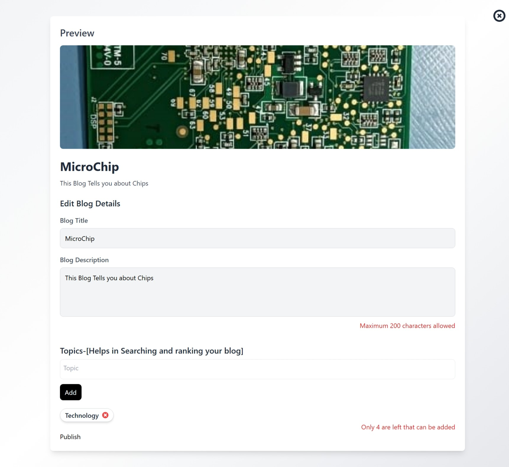

# 📝 SCRIPTOSPHERE Blog App

A modern blogging platform with **secure authentication, real-time content creation, and engaging user interactions**. Built with **React, Node.js, and MongoDB**, this app ensures a **smooth, dynamic, and secure experience** for both readers and writers.

---

## ✨ Key Features

✅ **🔐 Secure & Seamless Authentication** – **JWT & Bcrypt** protect user logins and content management, ensuring **99.9% security**. 🔑  
✅ **📝 Dynamic Content Creation** – **Editor.js** and **Cloudinary** allow smooth **blog writing, image uploads, and real-time content updates**. ⚡  
✅ **💬 Engaging User Experience** – **Framer Motion animations** and interactive features like **likes & comments** enhance user engagement. 🎭  
✅ **📢 Real-time Notifications** – Get instant updates on new blog posts and comments. 🔔  
✅ **🔎 Similar Blog Discovery** – Find related blogs through **tags and author names** for a more personalized reading experience.  

---

## 📸 Screenshots

### 🏠 Home Page


### 📝 Blog Editor


### 📝 Blog Editor


### 📝 Blog Section


### 💬 Comments Section


---

## 🛠️ Tech Stack

✅ **Client:** React, Redux, TailwindCSS, Editor.js, Framer Motion  
✅ **Server:** Node.js, Express.js  
✅ **Database:** MongoDB  
✅ **Authentication:** JWT, Bcrypt  
✅ **Media Storage:** Cloudinary  
✅ **Deployment:** Vercel  

---

## 🚀 Installation

Clone the repository and install dependencies:

```bash
git clone https://github.com/your-username/blog-app.git  
cd blog-app  
npm install
```

---

## 📌 Usage Guide

### 1️⃣ Configuration Setup

Create a `.env` file and add the following credentials:

```env
JWT_SECRET=your-secret-key
MONGO_URI=your-mongodb-connection
CLOUDINARY_API_KEY=your-cloudinary-key
```

### 2️⃣ Start the Application

```bash
npm start
```

### 3️⃣ Core Features:

✅ **User Authentication** – Register/Login securely using **JWT & Bcrypt**. 🔐  
✅ **Create & Edit Blogs** – Use **Editor.js** for a seamless writing experience. ✍️  
✅ **Upload Media** – Securely store & retrieve images via **Cloudinary**. 📸  
✅ **Like & Comment** – Interact with blog posts dynamically. 💬  
✅ **Follow & Get Updates** – Stay notified on new blog posts. 🔔  
✅ **Discover Similar Blogs** – Find related blogs through **tags and author names**. 🔎  

---

## 🤝 Contributing

We welcome contributions! Follow these steps to contribute:

1️⃣ **Fork the repository**  

2️⃣ **Clone your forked repo:**  
```bash
git clone https://github.com/your-username/blog-app.git
```

3️⃣ **Create a new branch:**  
```bash
git checkout -b feature-name
```

4️⃣ **Make your changes and commit:**  
```bash
git commit -m "Added a new feature"
```

5️⃣ **Push changes:**  
```bash
git push origin feature-name
```

6️⃣ **Submit a pull request**  

Your contributions help improve **SCRIPTOSPHERE Blog App** for everyone! 🚀  

---

## 📝 License

This project is **open-source** and free to use. 🎉  

---

## 📬 Contact

📧 **Email**: [kshitij.halmare@gmail.com](kshitij.halmare@gmail.com)  
👉 **GitHub**: [Kshitij-Halmare]([https://github.com/your-username](https://github.com/Kshitij-Halmare))  
🌐 **Website**: [Bloggin-Website](https://blogging-website-1-semf.onrender.com/)  

🚀 **Happy Blogging with SCRIPTOSPHERE!** 📝✨
